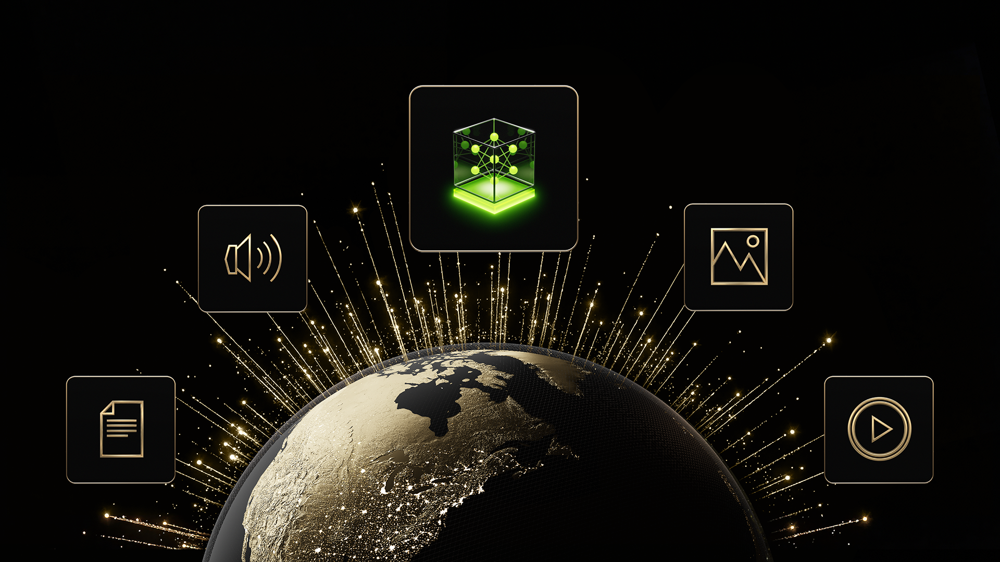
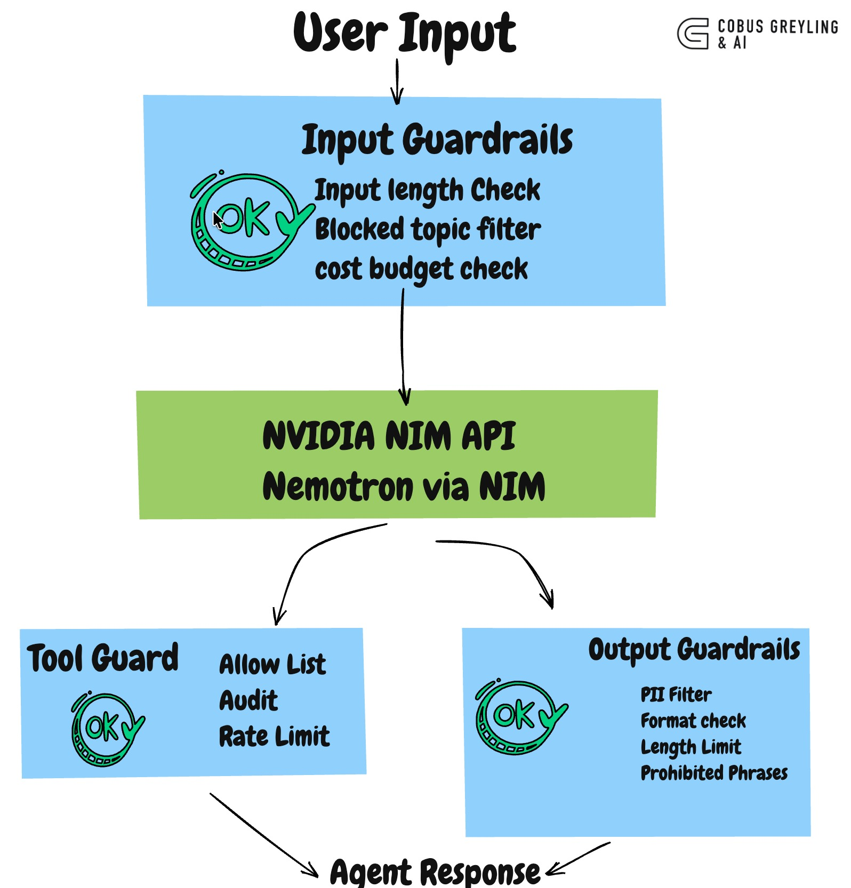

# nim-agent-guardrails



> Runtime safety layer for NVIDIA NIM-powered agents.

Composable guardrails that wrap every NIM API call — input validation, output filtering, PII detection, tool-call auditing, and cost controls. **One import. No infrastructure.**

[](https://github.com/cobusgreyling/nim-agent-guardrails/actions/workflows/ci.yml)
[](https://opensource.org/licenses/MIT)
[](https://www.python.org/downloads/)
[](https://build.nvidia.com)

**🌐 [View the interactive showcase landing page](https://cobusgreyling.github.io/nim-agent-guardrails/)** (no install required)

> **Seeing a 404?** GitHub Pages needs a one-time setup: Repo → Settings → Pages → Source: `main` + `/docs` folder.  
> Instant fallback: [htmlpreview link](https://htmlpreview.github.io/?https://raw.githubusercontent.com/cobusgreyling/nim-agent-guardrails/main/docs/index.html)





```
  User Input
       │
       ▼
  ┌─────────────────────────────┐
  │     INPUT GUARDRAILS        │
  │                             │
  │  ✓ Input length check       │
  │  ✓ Blocked topic filter     │
  │  ✓ Cost budget check        │
  └─────────────┬───────────────┘
                │
                ▼
  ┌─────────────────────────────┐
  │     NVIDIA NIM API          │
  │     (Nemotron via NIM)      │
  │                             │
  │  integrate.api.nvidia.com   │
  └─────────────┬───────────────┘
                │
       ┌────────┴────────┐
       │                 │
       ▼                 ▼
  ┌──────────┐    ┌─────────────────┐
  │  TOOL    │    │    OUTPUT       │
  │  GUARD   │    │    GUARDRAILS   │
  │          │    │                 │
  │ ✓ Allow  │    │ ✓ PII filter    │
  │   list   │    │ ✓ Format check  │
  │ ✓ Audit  │    │ ✓ Length limit  │
  │ ✓ Rate   │    │ ✓ Prohibited    │
  │   limit  │    │   phrases       │
  └──────────┘    └─────────────────┘
       │                 │
       └────────┬────────┘
                │
                ▼
          Agent Response
```

## Why This Exists

Most guardrail libraries assume you want a separate service, a vector database, or a classifier model. For agents calling NVIDIA NIM, you usually just need fast, composable checks that run in-process — before the API call, after the response, and around tool execution.

This library gives you:

- **6 built-in guardrails** — input length, blocked topics, PII detection, output format, cost limits, tool-call auditing
- **Composable chains** — stack guardrails in any order, short-circuit on first failure
- **Full audit logging** — every turn records which guardrails ran, what passed, what blocked, and why
- **Zero infrastructure** — pure Python, runs in-process, no external services

## Install

### Recommended (no clone needed)

```bash
pip install "git+https://github.com/cobusgreyling/nim-agent-guardrails.git[nim]"
```

For the Gradio demo examples:

```bash
pip install "git+https://github.com/cobusgreyling/nim-agent-guardrails.git[nim,demo]"
```

### From source

```bash
git clone https://github.com/cobusgreyling/nim-agent-guardrails.git
cd nim-agent-guardrails
pip install -e ".[nim,demo,dev]"
```

Set your NIM API key (get a free one at [build.nvidia.com](https://build.nvidia.com)):

```bash
export NVIDIA_API_KEY=nvapi-...
```

## Quick Start

```python
from nim_guardrails import (
    NimClient,
    GuardedAgent,
    AgentConfig,
    GuardrailChain,
    InputLengthGuardrail,
    BlockedTopicGuardrail,
    PiiDetectionGuardrail,
    CostLimitGuardrail,
)

# Connect to NIM
client = NimClient()  # reads NVIDIA_API_KEY from env

# Define guardrail chains
input_guardrails = GuardrailChain([
    InputLengthGuardrail(max_chars=2000),
    BlockedTopicGuardrail(),
    CostLimitGuardrail(max_total_tokens=50_000),
])

output_guardrails = GuardrailChain([
    PiiDetectionGuardrail(check_output=True),
])

# Create a guarded agent
agent = GuardedAgent(
    client=client,
    config=AgentConfig(
        system_prompt="You are a helpful travel assistant.",
        model="nvidia/llama-3.1-nemotron-nano-8b-v1",
    ),
    input_guardrails=input_guardrails,
    output_guardrails=output_guardrails,
)

# Run it
response, record = agent.run("Plan a trip to Tokyo")
print(response)

# Check what happened
print(f"Blocked: {record.blocked}")
print(f"Latency: {record.latency_ms:.0f}ms")
print(f"Guardrails passed: {sum(1 for r in record.input_guardrail_results if r.passed)}")
```

## Built-in Guardrails

| Guardrail | Phase | What It Does |
|---|---|---|
| `InputLengthGuardrail` | Input | Rejects inputs exceeding character or token-estimate limits |
| `BlockedTopicGuardrail` | Input/Output | Blocks messages matching configurable regex patterns |
| `PiiDetectionGuardrail` | Output (or Input) | Detects emails, phone numbers, SSNs, credit cards |
| `OutputFormatGuardrail` | Output | Validates length, required sections, prohibited phrases |
| `CostLimitGuardrail` | Input | Tracks cumulative token usage against a budget |
| `ToolCallAuditGuardrail` | Tool | Allow/block-lists for tools, rate limiting, audit logging |

## Writing Custom Guardrails

Subclass `Guardrail` and implement `check`:

```python
from nim_guardrails import Guardrail, GuardrailResult

class LanguageGuardrail(Guardrail):
    name = "language_check"

    def check(self, *, output_text=None, **_):
        if output_text and "sorry" in output_text.lower():
            return self._fail("Model apologised — likely refusing the task")
        return self._ok("No apology detected")
```

Add it to a chain:

```python
output_guardrails.add(LanguageGuardrail())
```

## Examples

### Travel Agent with Gradio UI

Full agent with flight search, hotel search, and weather tools — guardrail enforcement visible in real time:

```bash
pip install "git+https://github.com/cobusgreyling/nim-agent-guardrails.git[nim,demo]"
python examples/travel_agent_demo.py --gradio
```

### Guardrails-Only Demo (No API Key Needed)

Test guardrail configurations without calling NIM:

```bash
python examples/guardrails_only_demo.py
```

Output:

```
[PASS] Normal input
  input_length: pass — Input length OK
  blocked_topic: pass — No blocked topics found
  cost_limit: pass — Budget OK: 0/10000 tokens used

[FAIL] Blocked topic in input
  input_length: pass — Input length OK
  blocked_topic: FAIL — Blocked topic detected in input: 'exploit'

[FAIL] Output with PII (email)
  pii_detection: FAIL — PII detected: email

[FAIL] Blocked tool call
  tool_call_audit: FAIL — Tool not in allow-list: delete_account
```

## Audit Log

Every agent turn produces a structured audit record:

```python
import json
print(json.dumps(agent.get_audit_log(), indent=2))
```

```json
[
  {
    "turn": 1,
    "blocked": false,
    "latency_ms": 1250.3,
    "model": "nvidia/llama-3.1-nemotron-nano-8b-v1",
    "usage": {"prompt_tokens": 142, "completion_tokens": 89, "total_tokens": 231},
    "nim_latency_ms": 1180.5,
    "guardrails": {
      "input": [
        {"name": "input_length", "passed": true, "message": "Input length OK"},
        {"name": "blocked_topic", "passed": true, "message": "No blocked topics found"}
      ],
      "output": [
        {"name": "pii_detection", "passed": true, "message": "No PII detected"}
      ],
      "tool": []
    }
  }
]
```

## Project Structure

```
nim-agent-guardrails/
├── nim_guardrails/
│   ├── __init__.py          # Public API
│   ├── guardrails.py        # Guardrail definitions + chain
│   ├── client.py            # NIM API client (OpenAI-compatible)
│   └── agent.py             # GuardedAgent with full lifecycle
├── docs/
│   ├── index.html           # ✨ Interactive showcase landing page (self-contained)
│   └── README.md            # How to view / host the landing page
├── examples/
│   ├── travel_agent_demo.py       # Full agent with Gradio UI
│   └── guardrails_only_demo.py    # Test guardrails without API key
├── tests/
│   └── test_guardrails.py   # 37 unit tests
├── .github/workflows/
│   └── ci.yml               # GitHub Actions (pytest on 3.10-3.12)
├── pyproject.toml
├── CHANGELOG.md
├── requirements.txt
└── LICENSE                  # MIT
```

## Requirements

- Python 3.10+
- `openai` (optional, only for `NimClient` + `GuardedAgent`; install with `[nim]` extra)
- `gradio` (optional, for the Gradio demo UI)
- NVIDIA NIM API key (free at [build.nvidia.com](https://build.nvidia.com)) — only needed when using the full agent against NIM

Core guardrails (`InputLengthGuardrail`, `PiiDetectionGuardrail`, etc.) have **zero runtime dependencies**.

## Contributing

We welcome contributions! Ideas for new guardrails, better PII detection, async support, more examples, and docs are all great.

- Fork, create a feature branch, add tests
- Run `pytest` before PR
- Open an issue to discuss larger changes

See the [GitHub repo](https://github.com/cobusgreyling/nim-agent-guardrails) for issues and discussions.

## License

MIT
